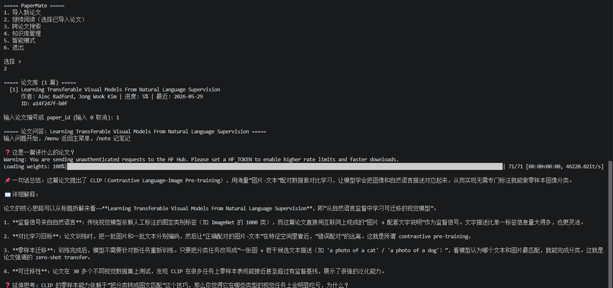
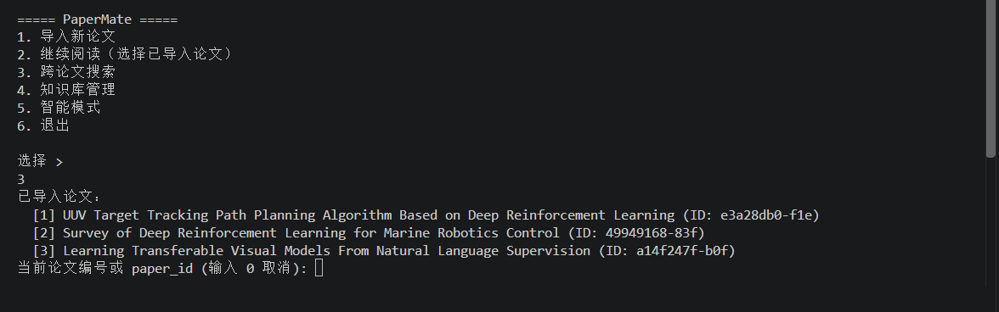
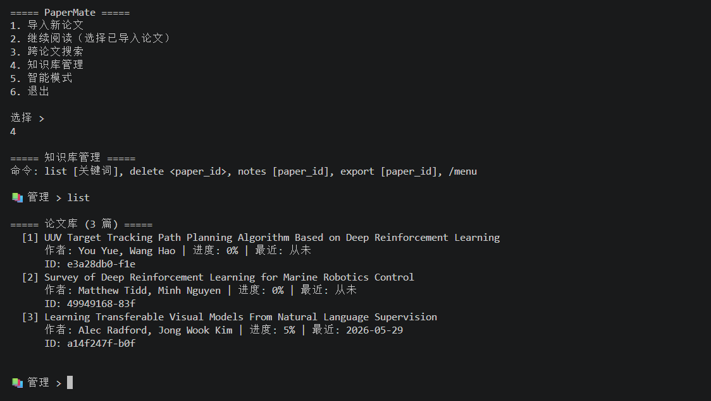

# PaperMate

PaperMate 是一个面向研究阅读的命令行论文助手。它将 PDF 解析、语义检索和大语言模型问答串成一条本地工作流，帮助读者围绕论文提问、比较多篇论文并整理阅读笔记。

## 功能

- 导入 PDF，提取文本与基础元数据，并将内容分块后建立向量索引。
- 针对已导入论文进行带检索上下文的问答，并支持连续追问。
- 跨论文检索与比较，查找不同论文对同一问题的相关内容。
- 管理论文与阅读笔记，支持查看和导出 Markdown 笔记。
- 将论文元数据和阅读记录存入本地 SQLite，将文本向量存入本地 ChromaDB。

## 技术栈

Python、LangGraph、LangChain、DeepSeek、Docling、Sentence Transformers、ChromaDB 和 SQLite。

## 环境要求

- Python 3.10 或更高版本（推荐 Python 3.11）。
- DeepSeek API Key。
- 首次运行时，Sentence Transformers 会下载 `all-MiniLM-L6-v2` 嵌入模型；请确保可以访问模型下载源并预留磁盘空间。

## 安装与配置

```bash
git clone https://github.com/yxl0808/PaperMate.git
cd PaperMate
python -m venv .venv
```

激活虚拟环境：

```bash
# Windows PowerShell
.venv\Scripts\Activate.ps1

# macOS / Linux
source .venv/bin/activate
```

安装依赖并配置 API Key：

```bash
python -m pip install --upgrade pip
pip install -r requirements.txt
pip install sentence-transformers
```

将 `.env.example` 复制为 `.env`，然后编辑 `.env`，填入自己的密钥：

```dotenv
DEEPSEEK_API_KEY=你的DeepSeek_API_Key
DEEPSEEK_BASE_URL=https://api.deepseek.com
```

不要把 `.env` 或真实 API Key 提交到版本控制。

## 运行

```bash
python main.py
```

首次使用时，从主菜单选择“导入新论文”，输入 PDF 文件路径即可开始解析。之后可进入论文问答、跨论文搜索或知识库管理。问答过程中输入 `/menu` 返回主菜单，输入 `/note` 记录笔记。

## 运行效果

我实现了基于已导入论文内容进行检索问答的命令行流程。下图展示了我使用 PaperMate 阅读并询问 CLIP 论文的界面。





## 数据位置

- `data/learner.db`：论文元数据、阅读记录和笔记。
- `data/chroma/`：ChromaDB 向量索引。
- `data/papers/`：预留的论文文件目录。导入时也可直接输入其他位置的 PDF 路径。

上述运行数据默认保存在本机，不包含在 Git 仓库中。请自行备份重要数据。

## 当前说明

- 本项目目前提供交互式命令行界面，没有 Web UI。
- 生成式问答调用 DeepSeek API；论文文本会作为请求上下文发送给所配置的模型服务。请先确认论文内容适合发送到该服务。
- 语义向量由本地 Sentence Transformers 模型生成；首次启动可能需要下载模型。

## 开发检查

仓库目前没有配置独立的自动化测试套件。可在项目根目录执行 Python 编译检查：

```bash
python -m compileall agents core tools main.py onboarding.py supervisor.py
```

## 许可证

当前仓库尚未声明开源许可证。若计划允许他人使用、修改或再分发，请先添加合适的 LICENSE 文件。
